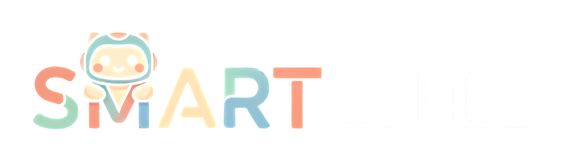
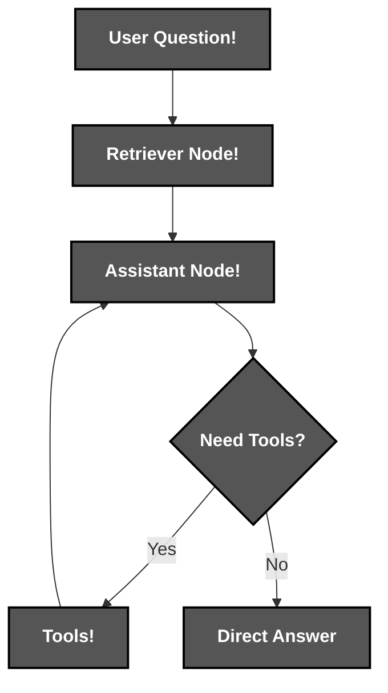

<div align="center">



*An AI agent that stands for **S**tructured **M**emory & **A**nalysis with **R**easoning and **T**ools*.
</div>

# 📝 **Description**

<div align="center">

***SMART Agent*** is a modular **AI agent** for advanced compositional reasoning via **semantic memory retrieval** and **tool integration**. 

Built specifically to tackle complex multi-step reasoning challenges like the ***GAIA-Level-1 dataset***. It actually ***thinks*** through problems step-by-steps to deliver accurate and explainable answers.
</div>
<br>
<div align="right">

***It was built for the [Hugging Face Agents Course](https://huggingface.co/learn/agents-course/unit0/introduction)*** 🤗

</div>

# 🛠️ **Agent Architecture & Workflow**

<div align="center">


</div>

# 📁 **Project Structure**

```
smartAgent/
├── .env                                                # Environment Variables
├── .gitattributes                                      # Git Attributes Configuration
├── .gitignore                                          # Git Ignore Rules
├── app.py                                              # Gradio Web Interface
├── LICENSE                                             # Project License
├── README.md                                           # You are here! ⬅️
├── requirements.txt                                    # Python Dependencies
│
├── docs/                                               # Documentation & Assets
│   └── assets/
│       ├── app-logo/                                   # App Logo
│       │   ├── logo-solid.png
│       │   ├── logo-transparent-bw.png
│       │   └── logo-transparent.png
│       └── certificates/                               # Certificates
│           ├── certificate-1.jpg
│           └── certificate-2.jpg
│
├── notebooks/                                          
│   └── notebook.ipynb                                  # Development Notebook & Analysis
│
└── src/                                                
    └── agent/
        ├── agent.py                                    # Core Agent Implementation
        │
        ├── config/
        │   └── system_prompt.txt                       # Agent Instructions
        │
        ├── data/
        │   └── metadata.jsonl                          # GAIA Dataset Sample
        │   
        └── database/
            └── supabase_vector_store_schema.sql        # Database Setup
```

# 🔧 **Installation**

## 📋 Requirements

- **Python 3.8+**
- **API keys** (minimum required):

  - [Groq](https://console.groq.com/)
  - [Tavily](https://tavily.com/)
  - [Supabase](https://supabase.com/)

## ⚙️ Quick Setup

1. **Clone the repository**
   ```bash
   git clone https://github.com/cristiangilsanz/smartAgent.git
   cd smartAgent
   ```

2. **Install dependencies**
   ```bash
   pip install -r requirements.txt
   ```

3. **Initialize the vector database**
   - Create a new *Supabase* project.

4. **Set up your environment**
   ```bash
   # Edit .env with your API keys

   cp .env.example .env
   ```

5. **Populate the vector database**
   - Run `supabase_vector_store_schema.sql` in its *SQL Editor Console* to set up the vector database.

   - Populate it with question-answer embeddings from the *GAIA-Level-1* dataset.
      - You can do this by running all the notebook cells up to cell *2.1.1*.

## 🧠 Choose Your AI Brain

***SMART Agent*** supports multiple LLM providers. You can edit `build_graph()` in `agent.py` to select yours:

```python
# Option 1: Groq (Recommended - Fast & Free)
agent = BasicAgent(provider="groq")

# Option 2: Google Gemini
agent = BasicAgent(provider="google")

# Option 3: Hugging Face
agent = BasicAgent(provider="huggingface")
```
<div align="right">

***[Groq](https://groq.com/) is set by default.***

</div>

⚠️ *You must have the API key for the LLM you’re actually using.*

<br>

# 🚀 **See *SMART Agent* in Action**

## ⏱️ To Run a Quick Test:

1. **Go to the `src/agent` directory:**

```bash
cd src/agent
```

2. **Edit `agent.py`:**

```python
if __name__ == "__main__":
    agent = BasicAgent(provider="groq")
    question = (
        "This is my question."
    )
    answer = agent(question)
    print(answer)
```

3. **Run `agent.py`:**

```bash
python agent.py
```

## 📏 To Launch the Gradio Interface:

1. **Run `app.py`:**

```bash
python app.py
```

# 🎮 **Try *SMART Agent* Online**

Want to see it in action without the setup? Try the live demo on [*Hugging Face Spaces*](https://huggingface.co/spaces)!

<div align="center">

**🔗 [Launch *SMART Agent* on Hugging Face Spaces](https://huggingface.co/spaces/cristiangilsanz/smartAgent)**

</div>

You can query your own questions! Furthermore, the online version runs the full ***GAIA-Level-1 benchmark*** and shows real-time performance metrics.

# 💡 **Tips for Best Results**

To get the most out of your interactions, ask clear and specific questions, and don’t hesitate to mix different types—whether math, factual, or research-based. This way, you’ll ensure more accurate and insightful answers.

**Examples of a great question:**

> - "What's 15% of 240, and is that enough to buy something that costs $35?"  
> - "Who wrote 'Pride and Prejudice' and what other books did they write?"  
> - "Summarize the latest financial news from the U.S"  
> - "Find what breakthroughs have been made in using bioacoustic monitoring to study deep-sea ecosystem health"

# 📚 **Tech Stack & Other Resources**

## 📦 Tech Stack

### 🧩 **Programming Language**
- [Python](https://docs.python.org/3/)

### 🛠️ **Agent Frameworks**
- [LangChain](https://python.langchain.com/docs/introduction/)
- [LangGraph](https://langchain-ai.github.io/langgraph/)

### 🗣️ **Language Models**
- [ChatGroq](https://console.groq.com/docs/quickstart)
- [Google Generative AI](https://ai.google.dev/docs)
- [Hugging Face](https://huggingface.co/docs)

### 🔍 **External APIs**
- [Tavily Search](https://docs.tavily.com/)
- [Wikipedia API](https://wikipedia.readthedocs.io/)
- [ArXiv API](https://info.arxiv.org/help/api/)

### 🌐 **User Interface**
- [Gradio](https://www.gradio.app/docs)

### 💾 **Database**
- [Supabase](https://supabase.com/docs)

### 📊 **Data Processing**
- [Sentence Transformers](https://www.sbert.net/)
- [Pandas](https://pandas.pydata.org/docs/)

### ⚙️ **Configuration**
- [Python-Dotenv](https://pypi.org/project/python-dotenv/)
- [Pydantic](https://docs.pydantic.dev/)

## 🧪 Datasets & Research Papers
- [GAIA Benchmark](https://arxiv.org/abs/2311.12983)
- [Retrieval Augmented Generation (RAG)](https://arxiv.org/abs/2005.11401)
- [Tools by AI Agents](https://arxiv.org/abs/2304.08354)

# 🔬 **Research & Citations**
This project implements concepts from several research areas:

```bibtex
@article{SmartAgent2025,
  title={SmartAgent: Modular AI Agent for Advanced Compositional Reasoning},
  author={Cristian Gil Sanz},
  journal={AI Research},
  year={2025}
}
```
# 📄 **License**

This project is licensed under the MIT License - see the [LICENSE](LICENSE) file for details.

# 🎓 **Course Completion & Certificates**

<br>

<div align="center">
    
    
</div>

<br>

# 🙏 **Credits & Thanks**

Special thanks to [*Hugging Face*](https://huggingface.co/) for the incredible [Agents Course](https://huggingface.co/learn/agents-course/unit0/introduction) ✨.

# 📞 **Get Help & Connect**

- 💬 [Start a discussion](https://github.com/cristiangilsanz/smartAgent/discussions)
- 🐛 [Open an issue](https://github.com/cristiangilsanz/smartAgent/issues)

- 📧 cristiangilsanz@gmail.com

<div align="center">

**Made with 💖 for the AI Community**

[⭐ Star this repo](https://github.com/yourusername/agentmind) | [🍴 Fork it](https://github.com/yourusername/agentmind/fork)

<br>

<a href="https://www.buymeacoffee.com/cristiangilsanz" target="_blank">
  
</a>

</div>